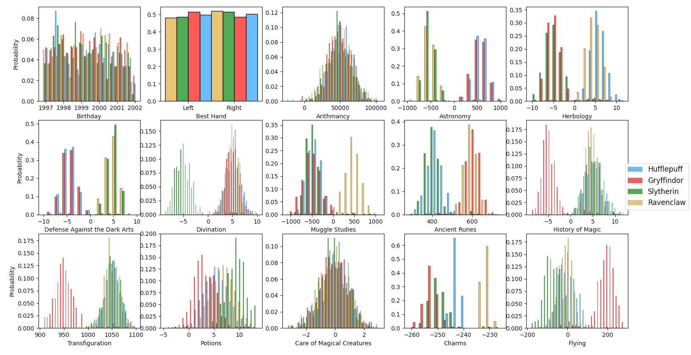
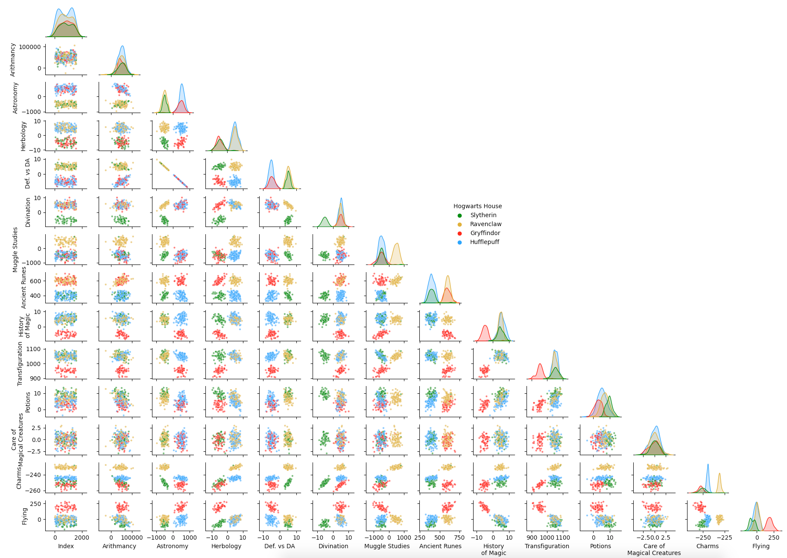
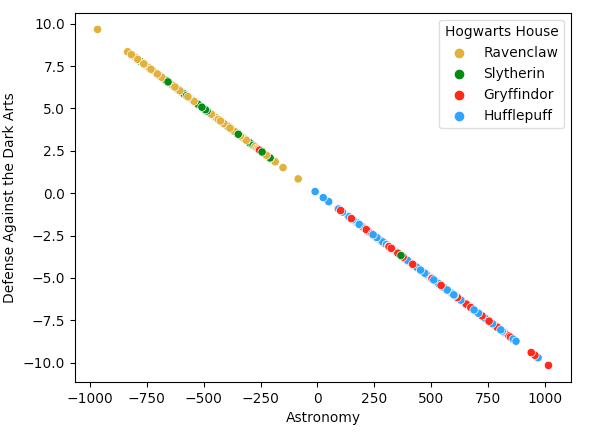
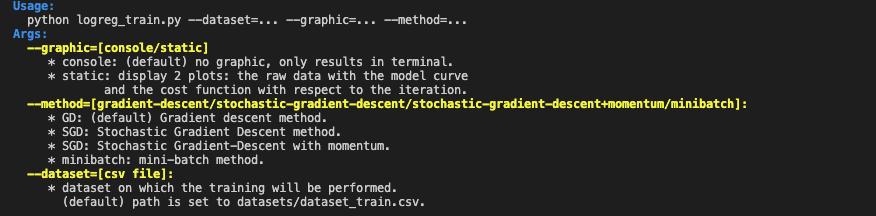

# DSLR:

---
## **In brief:**

### Description:
Subject from the 42 curriculum. This project was created by the 42AI student association. The goal of the subject is to discover the field of Data Science through the reconstitution of the sorting hat of Hogwarts.

### Objectives
* Data Science
* Statistics
* Visualiation
* Logistic Regression

### Skills
* Algorithms & AI
* DB & Data (*This is questionable, there is no DB manipulation in the sense we can think at first.*)

---

## Project:
As mentioned earlier, this project has been realized in the context of 42-curriculum. It is made of a **Mandatory Part** and a **Bonus Part**. This project aims to learn the basics concept of the logistic regression and code a *One-vs-All* classifier.\
About the datasets, these are the property of 42, It cannot be shared on this repository. However here a description:

## datasets:
### dataset_train.csv
The dataset dedicated for the training is constituted of the following columns: [*Index*,*Hogwarts House*,*First Name*,*Last Nam*e*,Birthday*,*Best Hand*,*Arithmancy*,*Astronomy*,*Herbology*,*Defense Against the Dark Arts*,*Divination*,*Muggle Studies*,*Ancient Runes*,*History of Magic*,*Transfiguration*,*Potions*,*Care of Magical Creatures*,*Charms*,*Flying*] (**20 columns** in total) and contains **1600 rows/examples**.

| Column name                   | data type    |
|:------------------------------|:------------:|
| Index                         | int          |
| Hogwarts House                | object (str) |
| First Name                    | object (str) |
| Last Name                     | object (str) |
| Birthday                      | object (str) |
| Best Hand                     | object (str) |
| Arithmancy                    | float        |
| Astronomy                     | float        |
| Herbology                     | float        |
| Defense Against the Dark Arts | float        |
| Divination                    | float        |
| Muggle Studies                | float        |
| Ancient Runes                 | float        |
| History of Magic              | float        |
| Transfiguration               | float        |
| Potions                       | float        |
| Care of Magical Creatures     | float        |
| Charms                        | float        |
| Flying                        | float        |

All the columns can be used as variable except the column ***Hogwarts House*** which is the target and ***Index*** which is irrelevant.

### dataset: dataset_test.csv
The dataset for the test is used to make prediction only. It has the same columns than the dataset of training and 400 rows.
There is no value in the column ***Hogwarts House*** as this is the target column.


## Mandatory Part:

### Starters:
Simple programs have to be made before the programs for training and predict.

#### describe.py:
The first program made for the project is ```describe.py``` which should display the same information than the ```DataFrame.describe``` in **Pandas**. In the following snippet, you can see some examples of the use of this program.

```
$> python describe.py
No argument has been given: python describe.py -h/--help/--usage

$> python describe -h
Usage:
  python describe.py dataset.csv

$> python describe.py datasets/dataset_train.csv
          Arithmancy    Astronomy    Herbology  Defense Against the Dark Arts  ...      Potions  Care of Magical Creatures       Charms       Flying
count    1600.000000  1600.000000  1600.000000                    1600.000000  ...  1600.000000                1600.000000  1600.000000  1600.000000
mean    48579.839844    39.001186     1.117486                      -0.380349  ...     5.838804                  -0.052091  -243.374420    21.958014
std     16529.330078   514.905334     5.163978                       5.160408  ...     3.119169                   0.958930     8.780894    97.601089
min    -24370.000000  -966.740540   -10.295663                     -10.162120  ...    -4.697484                  -3.313676  -261.048920  -181.470001
25%     38744.000000  -487.110260    -4.239521                      -5.199248  ...     3.690323                  -0.650477  -250.647263   -41.840000
50%     49586.000000   283.786621     3.578670                      -2.375101  ...     5.966365                  -0.003950  -244.867508    -2.510000
75%     62124.000000   535.160217     5.524066                       5.006484  ...     8.433526                   0.662091  -232.536743    50.889999
max    104956.000000  1016.211914    11.612895                       9.667405  ...    13.536762                   3.056546  -225.428146   279.070007

$> python describe.py toto.csv
First parameter is not a dataset or any flags for help/usage.
```

#### histogram.py:
This program displays histograms for each numerical variables in datasets/dataset_train.csv.



#### pair_plot.py:
This program tackle the concept of the pair plot, more precisely the joint distributivity of 2 variables. For the project, it helps the student to choose the features which may be used in the model.



#### scatter_plot.py:
This program answer to the question: *What are the 2 features which are similar?*. As we can see on the following plot, **Astronomy** and *Defense Against the Dark Art* have a linear relation.



### Training and prediction:
#### Training:
The training of the *One-vs-All* model is realized by the program ```logreg_train.py```.
Here the usage of the program (```python logreg_train.py -h/--help/--usage)



The model is constituted of 4 logistic classifiers, one for each class of ***Hogwarts House***.
In the mandatory part, only the *gradient descent method* for the optimization and the *binary cross entropy* for the loss function are asked. Extra optimization methods were implemented, more details is given in the section **(a definir)**.